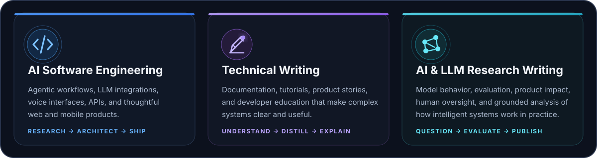

  

  

  
  
  
  

## A little about me

I’m **Olarewaju Adebulu**, a product-minded AI software engineer and technical communicator based in Nigeria. I build intelligent web and mobile products, then make the ideas behind them easier to understand through clear technical and research writing.

My work sits at the intersection of **AI agents, full-stack engineering, LLM research, product thinking, and developer education**. I enjoy moving from a fuzzy problem to a useful product—researching deeply, designing the system, shipping the experience, and documenting what matters.

> **My working philosophy:** Research deeply. Build simply. Explain clearly. Verify before shipping.

## What I do

  

### The work behind the titles

- **AI software engineering** — building agentic workflows, LLM-powered features, voice experiences, APIs, and production-ready web and mobile products.
- **Technical writing** — turning complex systems into useful documentation, tutorials, product narratives, and developer-friendly explanations.
- **AI & LLM research writing** — exploring model behavior, evaluation, human-in-the-loop systems, responsible adoption, and the practical impact of intelligent software.

## What I’m exploring now

<table>
  <tr>
    <td width="50%" valign="top">
      <h3>🤖 Agentic products</h3>
      Designing AI agents that support real work with clear boundaries, useful memory, thoughtful orchestration, and human oversight.
    </td>
    <td width="50%" valign="top">
      <h3>🎙️ Voice-first experiences</h3>
      Exploring natural voice interfaces for research, feedback, accessibility, and lower-friction human-computer interaction.
    </td>
  </tr>
  <tr>
    <td width="50%" valign="top">
      <h3>🧠 LLM research & evaluation</h3>
      Studying how language models behave, how we evaluate useful outputs, and how research becomes better product decisions.
    </td>
    <td width="50%" valign="top">
      <h3>✍🏽 Developer communication</h3>
      Writing technical content that helps builders understand systems, make informed choices, and move from theory to implementation.
    </td>
  </tr>
</table>

## Writing & research

I write for engineers, product builders, technical teams, and curious people navigating AI. My aim is not to make complex topics sound impressive—it is to make them **clear, accurate, and useful**.

  
  

**Topics I care about:** AI agents · LLM evaluation · AI product design · voice interfaces · human-centered AI · software architecture · developer education · technical documentation.

## Technology I work with

  

  <code>Product discovery</code> · <code>System design</code> · <code>Prompt design</code> · <code>LLM evaluation</code> · <code>API architecture</code> · <code>Technical documentation</code>

## Live build signals

  
  

  

## Selected products

Repositories come after the story because code matters most when the problem and product thinking are clear.

<table>
  <tr>
    <td width="50%" valign="top">
      <h3><a href="https://github.com/Larriemoses/Voice-First-Survey-App">Voice-First Survey App</a></h3>
      A multi-tenant research platform that lets people respond naturally by voice instead of fighting long forms.
        
      
    </td>
    <td width="50%" valign="top">
      <h3><a href="https://github.com/Larriemoses/FlowMeld">FlowMeld</a></h3>
      An AI-powered life, team, and content orchestrator built around customizable agents and collaborative planning.
        
      
    </td>
  </tr>
  <tr>
    <td width="50%" valign="top">
      <h3><a href="https://github.com/Larriemoses/Nuyu-Recovery-Home">Nuyu Recovery Home</a></h3>
      A full-stack booking and operations product with scheduling controls, payments, and administrative insights.
        
      
    </td>
    <td width="50%" valign="top">
      <h3><a href="https://github.com/Larriemoses/Discount-Center">Discount Center</a></h3>
      A fast, search-focused product for discovering relevant discounts and offers across Nigeria and Africa.
        
      
    </td>
  </tr>
</table>

  

---

<h2 align="center">Let’s turn a useful idea into a clear, intelligent product.</h2>

  I’m open to thoughtful product collaborations, AI engineering work, technical writing, and AI/LLM research writing.

  
  

  Built with curiosity, clear thinking, and a bias toward useful things.

