  

  
  
  

<strong>AI software engineer · product builder · technical communicator</strong>

I research difficult problems, build useful AI products, and explain the systems clearly enough for other people to trust and use them.

## Current focus

### 🔐 [Sycrely](https://github.com/Larriemoses/sycrely)

An experimental local-first privacy editor for people who want to use hosted AI without unnecessarily exposing names, contact details, financial information, or confidential ideas.

Sycrely asks a simple question: **what exactly leaves the device?** It explores local prompt analysis, protected previews, privacy minimisation versus answer usefulness, Nigerian-language evaluation, browser inference and AI-security threat modelling.

> Sycrely is currently an experimental prototype, not a replacement for enterprise DLP or a guarantee of perfect privacy.

### 🧪 AI product research and evaluation

I study how AI products should handle uncertainty, human review, sensitive context, hallucinations and real-world evaluation. My work moves between product discovery, system design, implementation, security analysis and technical documentation.

## Selected work

### [Sycrely](https://github.com/Larriemoses/sycrely) · AI privacy research
Local-first privacy editor and research prototype with local classification, purpose-aware privacy policies, encrypted browser sessions, outbound previews, annotation workflows and a documented threat model.

### [irinabo](https://github.com/Larriemoses/irinabo) · WhatsApp-first reporting
A TypeScript product for journey reporting, protected routing and accountable follow-up.

### [FaithCine](https://github.com/Larriemoses/faithcine-website) · media platform
A Christian media platform for films, Gospel content, Scripture tools, children’s content and editorial publishing.

### [FaithCine Selah](https://github.com/Larriemoses/faithcine-selah) · mobile experience
An Expo and Supabase scripture meditation app with AI-assisted sessions, journaling and audio meditation.

### [Voice-First Survey App](https://github.com/Larriemoses/Voice-First-Survey-App) · voice research
A multi-tenant research platform designed to let people respond naturally by voice instead of navigating long forms.

### [Nuyu Recovery Home](https://github.com/Larriemoses/Nuyu-Recovery-Home) · operations product
A full-stack booking and operations product with scheduling, payments and administrative workflows.

### [AI Security Learning Lab](https://github.com/Larriemoses/AI-Security-Learning-Lab) · research documentation
A structured, research-driven record of learning about AI security, machine learning, cloud platforms and technical communication.

### [WaHustle](https://github.com/Larriemoses/WaHustle) · conversational commerce
A WhatsApp bot designed to support sales workflows.

### [Apexium Website](https://github.com/Larriemoses/Apexium-Website) · business platform
A professional business-support website focused on regulatory compliance and legal documentation.

### [Eragon](https://github.com/Larriemoses/Eragon) · commerce utility
A coupon-code web product built with Django and React.

### [FlowMeld](https://github.com/Larriemoses/FlowMeld) · AI orchestration
An AI-powered life and team orchestration project.

### [Discount Center](https://github.com/Larriemoses/Discount-Center) · search product
A search-focused product for discovering relevant discounts and offers across Nigeria and Africa.

### [LMPortfolio](https://github.com/Larriemoses/LMPortfolio) · portfolio system
A TypeScript portfolio project documenting product and engineering work.

### [MMPP](https://github.com/Larriemoses/MMPP) · JavaScript project
An earlier JavaScript product and experimentation repository.

### [TailorMind Assessment](https://github.com/Larriemoses/TailorMind_Assessment) · assessment product
A TypeScript assessment project released under the GNU GPL v3.0.

### [Reac Projects](https://github.com/Larriemoses/Reac_Projects) · frontend practice
A collection of earlier ReactJS projects and experiments.

## Build philosophy

I take a problem from uncertainty to something useful:

1. Research the problem and its users.
2. Define a focused product boundary.
3. Build a simple working system.
4. Test the experience and the failure cases.
5. Document what is true, uncertain and worth improving.

> Research deeply. Build simply. Explain clearly. Verify before shipping.

## Tools and interests

`TypeScript` · `React` · `Next.js` · `Node.js` · `Python` · `PostgreSQL` · `Supabase` · `AWS` · `LLM evaluation` · `system design`

AI software engineering · privacy-preserving AI · agentic products · voice interfaces · human-centred AI · product design · technical writing · developer education

## Let’s build something useful

I’m open to thoughtful collaborations in AI engineering, privacy-aware product development, technical writing, research communication and LLM evaluation.

Explore my [repositories](https://github.com/Larriemoses?tab=repositories), read my [writing](https://larriemoses.medium.com), or connect through [LinkedIn](https://www.linkedin.com/in/olarewajuadebulu).

Research deeply · build simply · explain clearly · verify before shipping.

